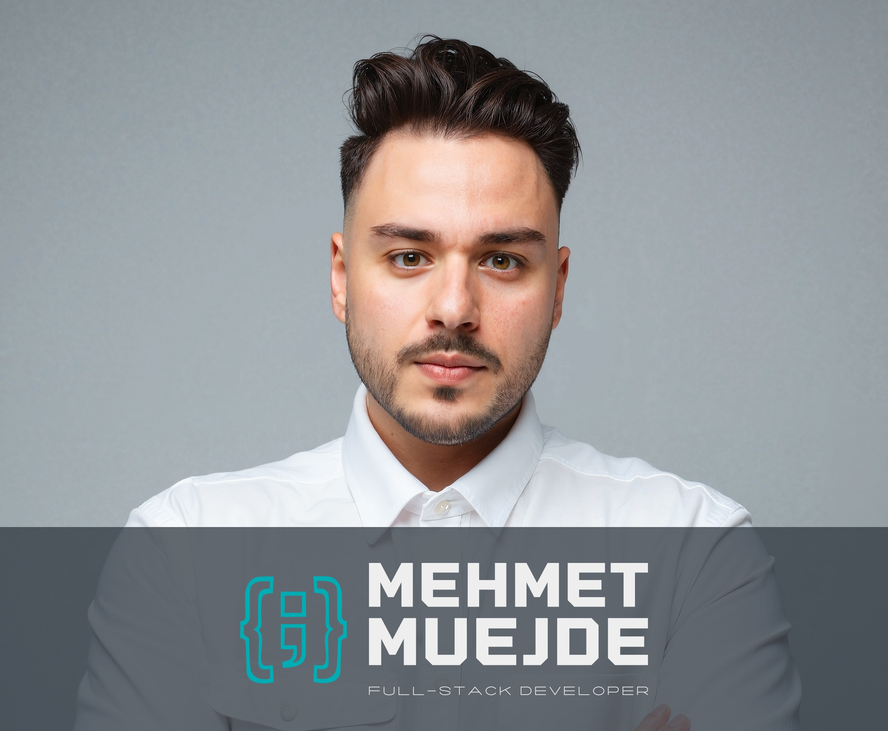

  

<h1 align="center">Hi, I’m Mehmet Müjde (@mmuejde) 👋</h1>

  Senior Full Stack Developer (Freelancer)
   
  <strong>Building scalable software with intelligence and precision</strong>

---

### 🧠 About Me

- 👨‍💻 Passionate about **Software Engineering**, **Machine Learning**, and **AI-driven systems**
- 🏗️ I build **full-stack applications**, **AI-powered tools**, and **scalable cloud infrastructures**
- 🎓 Studied **Mechatronics** & **Computer Science** · Currently pursuing **M.Sc. in Data Science @ RWTH Aachen**
- 🤝 I work freelance with startups, industry clients, and research institutions
- 📄 Check out my [freelancer portfolio at FlowCV »](https://flowcv.com/resume/6ffs0qd5q5d1)

---

### 📫 Let's Connect

- 🌐 Website: [mehmetmuejde.com](https://www.mehmetmuejde.com)  
- 📧 Email: [freelancer@mehmetmuejde.com](mailto:freelancer@mehmetmuejde.com)  
- 💼 LinkedIn: [linkedin.com/in/mehmetmuejde](https://www.linkedin.com/in/mehmetmuejde)

---
